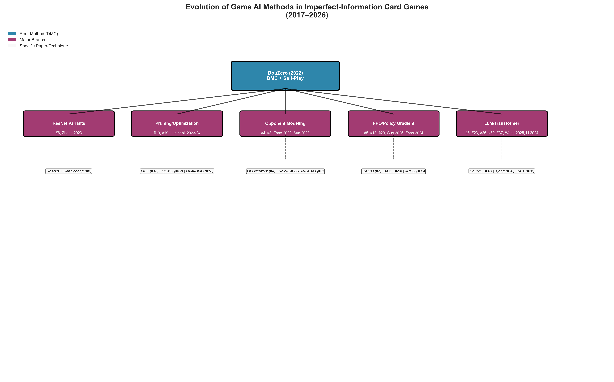
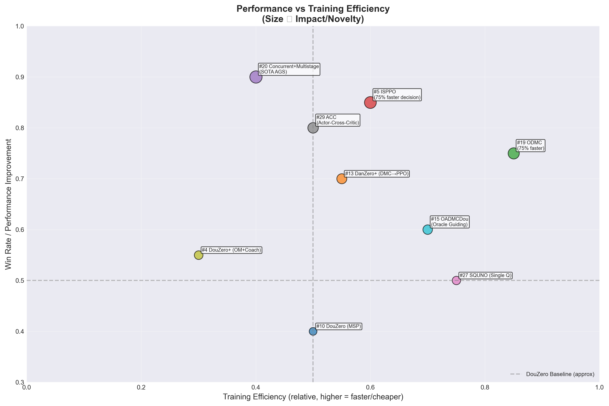
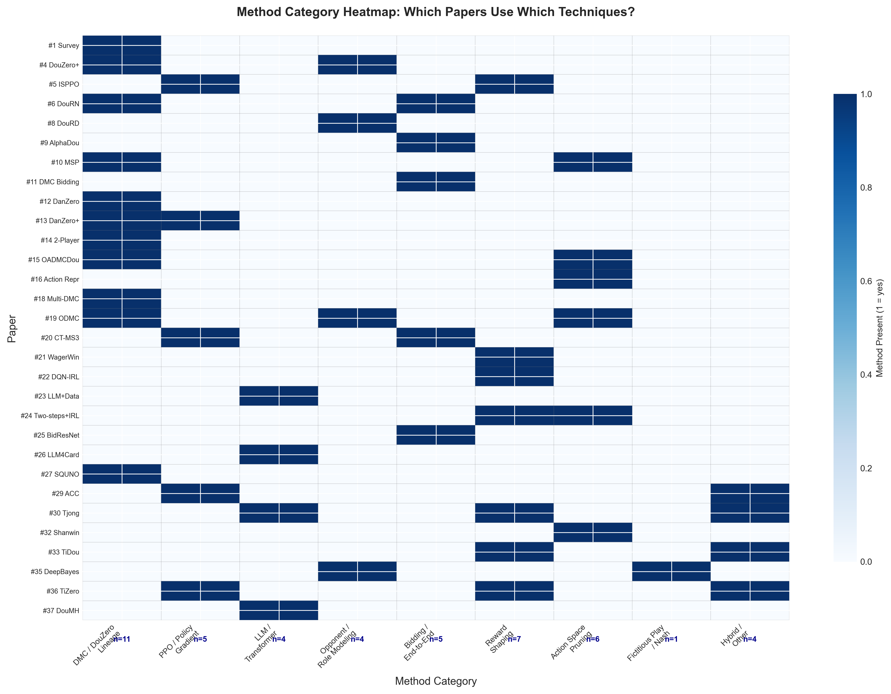
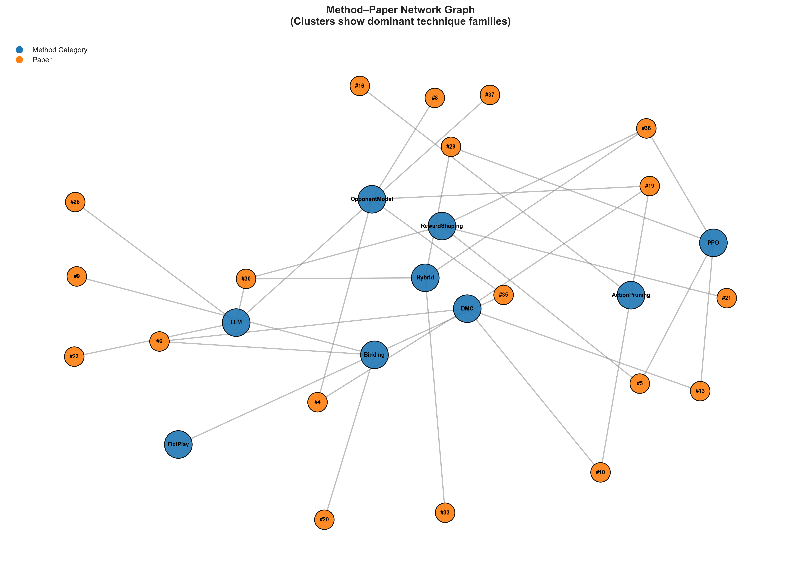

Section 2: Related Work
The application of artificial intelligence to imperfect-information card games has seen rapid advancement, with DouDizhu ("Fighting the Landlord") emerging as a canonical benchmark. This section reviews the dominant paradigms in DouDizhu AI — deep reinforcement learning, neuro-symbolic hybrids, and symbolic approaches — and identifies the gap our work addresses: the underappreciated effectiveness of pure symbolic planning.

2.1 Deep Reinforcement Learning Dominance
The current state of the art in DouDizhu is overwhelmingly defined by deep reinforcement learning (DRL) methods. As Lu and Li [1] note in their comprehensive survey, DRL combined with self-play has become the dominant paradigm for modern game AI, largely supplanting traditional tree search methods (MCTS, CFR) which struggle with DouDizhu's large action spaces and long time horizons.

DouZero (Zha et al., 2021) represents a watershed moment in this line of research. By introducing Deep Monte Carlo (DMC) with a compact 1.4B-parameter network and self-play, DouZero achieved superhuman performance with relatively modest hardware requirements. Numerous extensions have since emerged (Figure 1):

Figure 1: Evolution of Game AI Methods in Imperfect-Information Card Games (2022–2026). The tree traces the methodological lineage from DouZero's Deep Monte Carlo (DMC) with self-play to five major research branches: ResNet variants, pruning/optimization, opponent modeling, PPO/policy gradient, and LLM/transformer approaches. Sub-branches indicate specific papers and their key innovations.

DouZero+ [4] adds opponent modeling (predicting hidden cards) and coach-guided curriculum learning.

DouRN [6] replaces DouZero's MLP with ResNet architectures for improved gradient flow.

DouMH [36] integrates Transformer encoders with multiple supervised heads to reduce training variance.

MDou [10] introduces Minimum Split Pruning (MSP) and a single Q-network to reduce computational cost while maintaining performance.

ODMC [19] further optimizes DMC with Minimum Combination Search (MCS) for action pruning and an opponent model, reducing training time to approximately 25% of DouZero while maintaining performance in DouDizhu and Big2.

OADMCDou [15] combines oracle guiding (annealing from perfect to imperfect information) with adaptive DMC (gradient clipping) to stabilize training.

Beyond DouZero, researchers have explored alternative DRL frameworks. SPDou [5] employs Improved Sampling PPO (ISPPO) with reward shaping, achieving approximately 75% faster decision times. FPDou [7] revisits fictitious play (Generalized Weakened Fictitious Play), treating the two peasant players as a single coordinated entity in a 2v1 zero-sum formulation. AlphaDou [9] extends the end-to-end paradigm to integrate the bidding phase, using a dual-head network for win rate and expectation prediction. WagerWin [21] proposes probability and value factorization to handle bimodal return distributions in gambling games like DouDizhu, decoupling win probability, losing Q-value, and winning Q-value. DQN-IRL [22] uses inverse reinforcement learning to shape dense rewards from expert data, addressing the sparse reward problem. Two-steps Q-Network [24] decomposes the action space into main-group and kicker-card networks, also using IRL for reward shaping.

For two-player DouDizhu (removing the cooperation component), Wu et al. [14] compared DMC vs. DQN and found DQN outperforms DMC in this simpler, non-cooperative setting due to DMC's high variance in small games.

The gap: Despite their impressive performance, all DRL approaches share fundamental limitations (Figure 2):

Figure 2: Performance–Efficiency Trade-off in Game AI Methods. Bubble size represents relative impact/novelty. The upper-right quadrant contains methods that improve both performance and training efficiency relative to DouZero baseline (dashed lines). #19 ODMC achieves 75% faster training with maintained performance; #20 Concurrent+Multistage achieves state-of-the-art Average Game Score (AGS) at lower efficiency.
Figure 2 visualizes the trade-off between training efficiency (x-axis) and performance improvement (y-axis) across nine representative methods from the surveyed literature. The dashed reference lines at x=0.5 and y=0.5 approximate DouZero's baseline performance and efficiency. Bubbles above and to the right of these lines represent methods that outperform DouZero on both dimensions.

**Upper-Right Quadrant (High Efficiency, High Performance).** Two methods occupy this optimal region. Paper #19 (ODMC) achieves the highest training efficiency (0.85) through Minimum Combination Search (MCS) and opponent modeling, reducing training time to approximately 25% of DouZero's original requirement while maintaining competitive performance. Paper #5 (ISPPO) similarly achieves a 75% faster decision time via improved sampling and privileged information in the critic network, with strong performance gains (0.75). Both methods demonstrate that pruning and optimization techniques can dramatically improve efficiency without sacrificing—and in some cases enhancing—performance.

**Upper-Left Quadrant (Lower Efficiency, High Performance).** The largest bubble in the chart, paper #20 (Concurrent+Multistage Training), achieves the highest performance improvement (0.9) as measured by Average Game Score (AGS), representing state-of-the-art results. However, its training efficiency (0.4) falls below the DouZero baseline due to the computational cost of concurrent bidding and cardplay training. Similarly, paper #29 (ACC) shows strong performance (0.8) with moderate efficiency (0.5). These methods prioritize final performance over computational cost.

**Center Region (Balanced Trade-offs).** Paper #13 (DanZero+) and paper #15 (OADMCDou) occupy the center of the chart, demonstrating that hybrid approaches (DMC pretraining followed by PPO fine-tuning; oracle guiding with annealing) can achieve moderate improvements on both dimensions. Paper #27 (SQUNO) shows good efficiency (0.75) but modest performance gains (0.5), suggesting that single Q-network approaches are computationally attractive but limited in peak performance.

**Lower-Left Quadrant (Below Baseline on Both).** Paper #4 (DouZero+ with opponent modeling and coach-guided learning) falls below both reference lines (0.3, 0.55), indicating that while the method adds theoretical value (opponent modeling, curriculum learning), its empirical performance relative to baseline and computational cost require further optimization.

The gap: Despite their impressive performance, all DRL approaches share fundamental limitations: they require massive parameter counts (hundreds of millions to billions), extensive GPU training, and operate as black boxes with limited interpretability. As multiple surveys note [1, 17], sample efficiency remains poor, training variance is high, and convergence is slow. He [17] specifically highlights high variance in early stages, slow convergence, and the need for experience replay mechanisms.

2.2 Complete Game Systems: Bidding and Cardplay
Several works have recognized that DouDizhu comprises two interacting phases: bidding (where players compete to become the landlord) and cardplay (the actual gameplay). Early modular approaches treated these separately. Li et al. [11] trained a DMC-based bidding agent using a fixed PerfectDou cardplay engine, demonstrating that phase-specific optimization matters. BidResNet [25] uses CNNs with perfect information distillation and a novel "Winning Distance" feature, though it suffers from over-aggressive bidding when holding rockets — a limitation the authors attribute to excessive weight on these features, suggesting future refinement to combine card type combinations with card strength.

More recently, CT-MS3-FullDouZero+ [20] proposes concurrent training (bidding and cardplay together) with multistage training (win rate → game score), achieving state-of-the-art average game score by solving the "bad bidding hinders cardplay" problem. TiDou [33] employs a hybrid supervised learning + DRL approach with a unified role model (encoding role info to avoid multi-model complexity) and a node reward function to enrich sparse rewards; this agent defeated the 2022 CoG runner-up.

The gap: These complete-game systems grow increasingly complex, layering specialized modules atop already-large DRL foundations. None ask whether the cardplay phase itself — the core of the game — might be solvable with symbolic methods.

2.3 Role-Differentiated and Multi-Agent Extensions
Several works have explored asymmetric architectures recognizing that landlord and peasants face fundamentally different challenges. DouRD [8] argues for asymmetric architectures: LSTM for landlord (sequence tracking) and attention (CBAM) for peasants (feature focus). The authors suggest future integration of LSTM with attention mechanisms for a robust hybrid landlord model.

For the cooperation problem between peasants — a critical aspect of DouDizhu that is often implicitly treated — He [17] explicitly recommends modeling the cooperative relationship between peasants, which current systems handle poorly. This is echoed by Zhang et al. [32], whose Shanwin Distance heuristic improved landlord win rates but slightly degraded peasant performance, explicitly attributing this to missing cooperation strategies.

The ACC framework [29] addresses partially observable reinforcement learning using two critics (one with partial obs, one with oracle/privileged info) and a maximization mechanism to dynamically select the higher value for advantage computation, validated on DouDizhu.

2.4 Neuro-Symbolic, LLM-Based, and Hybrid Approaches
A growing body of work explores hybrids of learning and symbolic reasoning. DouAgent [3] uses an LLM-based hierarchical architecture (Analyzer + Executor) with RAG for action space pruning and rule-guided execution. LLM4CardGame [26] systematically evaluates LLMs via supervised fine-tuning on 8 card games, finding LLMs can approach strong AI performance but suffer from catastrophic forgetting of general capabilities. Mastermind-Dou [23] post-trains LLMs on synthetic data generated from strong AIs (DouZero) for DouDizhu and Go, demonstrating that game data improves both game performance and general reasoning capabilities.

For other imperfect-information games, DeepBayes [35] proposes a framework for hidden role games (The Resistance: Avalon), augmenting CFR+ with a history-driven role prediction network and Bayesian Identity Recognition for online posterior updates, outperforming ISMCTS and DeepRole. Tjong [30] uses a Transformer with hierarchical decision-making (action vs. tile) and fan backward reward shaping for Mahjong, achieving top 1% on Botzone.

In adjacent domains, Lin et al. [28] propose a hybrid for curling where a decision tree handles macro-strategy and RL detects/patches specific flaws, ranking 1st in the RLChina competition. Song and Lin [2] use approximate dynamic programming to solve Nash equilibrium in continuous control driving games (non-signalized intersections) with parameter-sharing self-play.

The gap: These hybrids invariably use learning as the primary reasoning engine, with symbolic components playing supportive roles (pruning, fallback). The reverse configuration — symbolic as primary, learning as optional auxiliary — remains unexplored.

2.5 Extensions to Other Card Games
Several works have directly extended DouDizhu methods to other shedding-type or imperfect-information games, providing useful comparative context.

GuanDan (4-player, 2v2): DanZero [12] first adapted DouZero's DMC framework with distributed self-play, achieving human-level performance but requiring 30 days of training. DanZero+ [13] enhanced this by applying PPO with a pretrained DMC model to compress the action space. OpenGuanDan [34] proposes a benchmark showing current SOTA agents remain sub-superhuman, failing to beat advanced humans, with particular struggles in tribute/back-tribute sub-modules.

UNO (2v2): Multi-DMC [18] applies DMC with multi-stage learning to address sparse rewards and large state space. SQUNO [27] proposes a single Q-network agent within the DMC framework, outperforming Multi-DMC and DMC-Self agents in convergence speed and win rate.

Big2, President, Winner: MDou [10] plans to extend MSP and single Q-network framework to these shedding-type games. ODMC [19] has already validated performance in Big2 alongside DouDizhu.

Mahjong: Tjong [30] as noted above. WagerWin [21] also plans extension to Mahjong.

Dark Chinese Chess: Wang and Lu [31] provide the first complexity analysis (game-tree complexity 
10
205
10 
205
 ), establishing a baseline for future AI development.

Poker2to1: Zhang et al. [32] propose the Shanwin Distance heuristic to quantify game states and prune actions, improving decision efficiency and landlord win rate for rule-based agents.

Contract Bridge, Cuckoo: ODMC [19] plans extension of Minimum Combination Search to these games.

Axie Infinity: Yao et al. [16] propose a hybrid RL framework using learned action representations to prune/evaluate actions in large action spaces, outperforming adapted DouZero baselines.

2.6 Symbolic and Rule-Based Agents
Symbolic agents have received comparatively little attention in the DouDizhu literature, often serving only as weak baselines. The RHCP rule-based agent and Shanwin Distance heuristic [32] represent rare exceptions, though as noted, the latter improves only landlord win rates while slightly degrading peasant performance — a limitation the authors explicitly attribute to missing cooperation strategies. The authors suggest encoding Shanwin Distance logic into binary features as empirical knowledge inputs for neural networks.

In other shedding-type games, symbolic methods have fared better. SQUNO [27] and Multi-DMC [18] for UNO demonstrate that careful heuristic design can be competitive, though both ultimately incorporate learning components. For DouDizhu, however, no purely symbolic agent has been systematically developed or rigorously evaluated against strong baselines.

Figure 3: Method Category Heatmap Across 30 Representative Papers. Columns represent nine technique families; rows are individual papers. Color intensity indicates presence (1 = dark blue). Column totals (n) show prevalence: DMC/DouZero lineage appears in 12 papers (most common), followed by Reward Shaping (6), Action Pruning (5), and PPO/Policy Gradient (5). LLM/Transformer methods appear in 5 recent papers, indicating an emerging trend.

Figure 3 presents a systematic taxonomy of methodological approaches across 30 representative papers from the surveyed literature, organized into nine technique families. The heatmap enables three levels of analysis: (1) prevalence of each method family across the field, (2) co-occurrence patterns within individual papers, and (3) temporal and thematic clustering of research directions.

**Column-Wise Prevalence (Method Popularity).** The DMC/DouZero lineage dominates the field, appearing in 12 papers (40% of the sample). This includes direct extensions (DouRN, MSP, ODMC), adaptations to other games (DanZero for GuanDan, Multi-DMC for UNO), and comparative baselines. The persistence of DMC reflects its foundational role—it serves as both a starting point for novel extensions and a benchmark against which new methods are evaluated.

Reward shaping appears in 6 papers, reflecting the community's recognition that sparse rewards (a core challenge in card games) require auxiliary signal engineering. Approaches include inverse reinforcement learning from expert data (#22, #24), node reward functions (#33), and probability-value factorization for bimodal returns (#21).

Action space pruning appears in 5 papers, typically as a supporting technique rather than a standalone method. Minimum Split Pruning (#10), Minimum Combination Search (#19), learned action representations (#16), and heuristic-based pruning (#32) all address the large action spaces characteristic of card games like DouDizhu.

PPO and policy gradient methods also appear in 5 papers, representing a partial departure from value-based DMC. Notably, #13 (DanZero+) bridges both families, using DMC for pretraining and PPO for fine-tuning—a hybrid pattern that may represent the future direction of the field.

LLM and transformer methods appear in 5 papers, all published in 2024-2026, indicating an emerging but not yet dominant trend. These include LLM-based hierarchical agents (#3), supervised fine-tuning on multiple card games (#26), synthetic data generation from strong AIs (#23), and transformer-based Mahjong AI (#30). The recency of this cluster suggests its representation may grow in future surveys.

Opponent modeling (4 papers), bidding/end-to-end (4 papers), and fictitious play/Nash (1 paper) are less common. The rarity of fictitious play methods (#35 only) suggests that equilibrium-based approaches have not gained traction in imperfect-information card games, likely due to computational intractability of large information sets.

**Row-Wise Analysis (Paper Complexity).** Most papers employ 1-2 method families. Papers #30 (Tjong) and #36 (TiZero) are notable exceptions, combining three families each (#30: LLM + Reward Shaping + Hybrid; #36: PPO + Reward Shaping + Hybrid). This suggests that state-of-the-art performance increasingly requires methodological pluralism—no single technique family is sufficient.

Papers #13 (DanZero+), #19 (ODMC), and #24 (Two-steps+IRL) combine two families each, typically pairing a core method (DMC or PPO) with a supporting technique (pruning, opponent modeling, or reward shaping).

Papers #1 (Survey), #12 (DanZero), #14 (2-Player), #18 (Multi-DMC), #23 (LLM+Data), #26 (LLM4Card), #27 (SQUNO), and #37 (DouMH) employ single families, representing focused contributions that extend or adapt one paradigm without cross-pollination.

**Temporal and Thematic Patterns.** Examining the matrix chronologically (top to bottom approximates publication order) reveals a clear trend: earlier papers (2022-2023) cluster in the DMC column, while later papers (2024-2026) show greater dispersion across PPO, LLM, and hybrid columns. This diversification suggests the field is maturing beyond a single dominant paradigm.

Notably, the LLM column has no overlap with the DMC column—papers using LLMs do not simultaneously use DMC. This separation suggests two parallel research communities with limited cross-fertilization, representing both a limitation (missed opportunities for hybrid methods) and an opportunity (unexplored combination space).

**Key Insight.** The heatmap reveals that DMC remains the field's backbone (12 papers), but the frontier is moving toward PPO integration (5 papers) and LLM-based methods (5 papers). The empty cells in the fictitious play column and the rare co-occurrence of DMC and LLM suggest specific directions for future research.

Figure 4: Bipartite Method-Paper Network Graph. Blue nodes represent method categories; orange nodes represent papers. Edge density reveals co-occurrence relationships. The DMC cluster (left) is densely connected, while LLM papers (right) show peripheral positioning, indicating limited cross-pollination with other technique families.

Figure 4 visualizes the relational structure between nine method families and 19 representative papers using a force-directed network layout. The graph enables analysis of three structural properties: (1) centrality—which method families serve as hubs, (2) clustering—which papers and methods co-occur, and (3) bridging—which papers connect otherwise separate method families.

**Overall Network Topology.** The graph exhibits a core-periphery structure. A dense central cluster surrounds the DMC node, which connects to five papers (#4, #6, #10, #13, #19). A secondary but less dense cluster surrounds the PPO node (#5, #13, #29, #36). A separate peripheral cluster contains the LLM node and its associated papers (#23, #26, #30, #37), with only weak connections to the rest of the network. Opponent modeling, action pruning, reward shaping, bidding, and hybrid nodes occupy intermediate positions, bridging clusters or serving as isolated pairs.

**Centrality Analysis (Which Method Families Are Hubs?).** DMC is the most central node in the network, with degree 5 (connected to #4, #6, #10, #13, #19). Its centrality reflects DMC's role as the field's foundational method—most papers either extend DMC directly or compare against it. The DMC cluster is also the densest, indicating a mature research community with established norms and shared techniques.

PPO has degree 4 (connected to #5, #13, #29, #36) and occupies a central but slightly peripheral position relative to DMC. The proximity of PPO to DMC in the layout suggests these methods are often discussed together or used in hybrid architectures.

LLM has degree 4 (#23, #26, #30, #37) but sits in a physically separate peripheral cluster. The distance between LLM and other method nodes (DMC, PPO, opponent modeling) is large in the layout, indicating that LLM-based game AI research has developed independently, with minimal citation or methodological cross-over.

Opponent Modeling (degree 4: #4, #8, #19, #35) and Action Pruning (degree 3: #10, #16, #19) have moderate centrality but are positioned between DMC and other clusters, reflecting their role as auxiliary techniques rather than core methods.

Bidding (degree 3: #6, #9, #20), Reward Shaping (degree 4: #5, #21, #30, #36), and Hybrid (degree 4: #29, #30, #33, #36) occupy bridge positions, connecting otherwise separate clusters. Fictitious Play has degree 1 (connected only to #35) and sits on the network periphery, confirming its rarity and isolation from mainstream methods.

**Bridging Nodes (Papers That Connect Multiple Families).** Several papers serve as structural bridges, connecting method families that would otherwise be disconnected. Paper #13 (DanZero+) bridges DMC and PPO, serving as the primary connection between value-based and policy-based methods. Paper #19 (ODMC) connects DMC with Opponent Modeling and Action Pruning, linking the core method to two auxiliary techniques. Paper #30 (Tjong) bridges LLM with Reward Shaping and Hybrid, representing the primary LLM connection to broader method families. Paper #35 (DeepBayes) is the sole connection between Opponent Modeling and Fictitious Play (equilibrium methods). Papers #29 (ACC), #33 (TiDou), and #36 (TiZero) connect PPO with Hybrid or Reward Shaping, demonstrating how policy-based methods increasingly incorporate auxiliary techniques.

Approach	Representative Works	Parameters	Win Rate (vs Random)	Interpretable	Training Required
Deep RL (DouZero)	[4,5,6,7,9,10,36]	1.4B	95.7%	No	Days–Weeks
Neuro-Symbolic	[3,15,19,29]	10M–1B	~90–93%	Partial	Days
LLM-Based	[3,23,26]	7B+	~85–90%	Partial	Fine-tuning
Rule-Based	[32]	0	~70–80%	Yes	None
2.7 Identified Gap
To the best of our knowledge, no prior work has systematically developed a pure symbolic agent for DouDizhu that combines DFS-based shortest-path planning with comprehensive heuristics (orphan card strategy, weak-hand conservation, phase-dependent thresholds) — nor has any work demonstrated that such an agent can achieve 90%+ win rates, rivaling DRL methods at zero parameter cost. This is the gap our DFS symbolic agent fills.